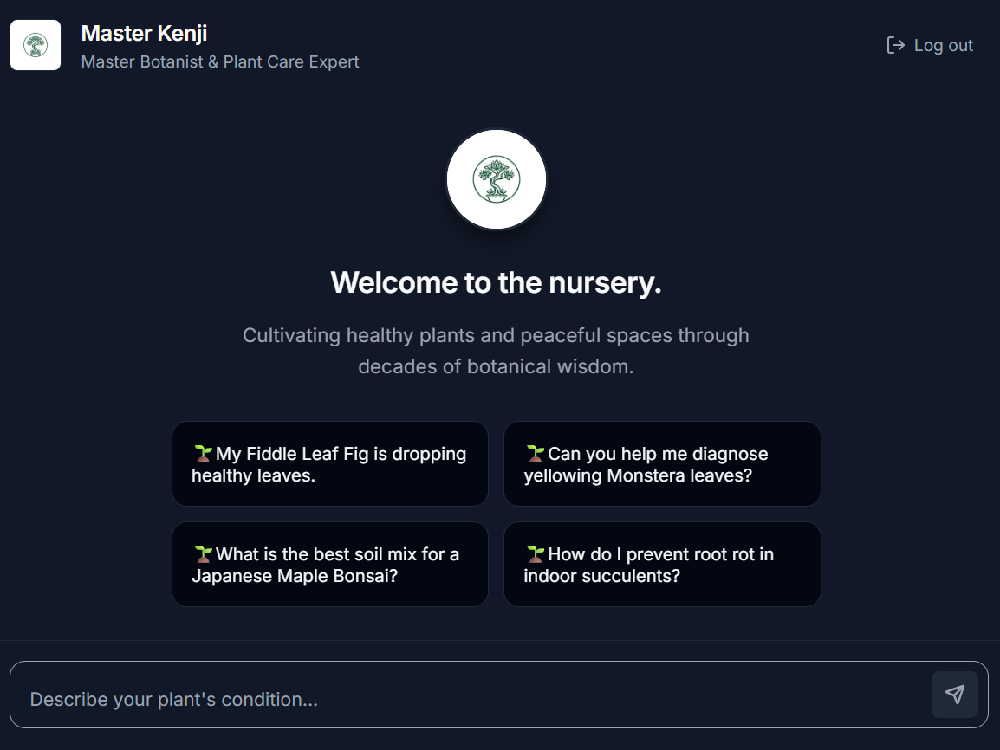
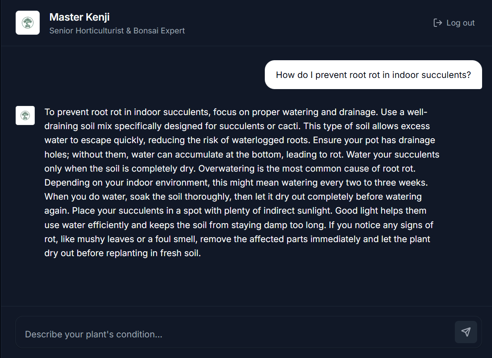

# Master Kenji: Horticultural Expert Chatbot

A purpose-built, highly polished conversational application providing expert advice on bonsai and indoor plant care. Built for the Thinkly Labs Software Engineering Assignment.

## Overview

This project focuses heavily on "Frontend Thinking," replacing generic chat wrapper templates with a highly considered, zero-fluff SaaS chat UI. The AI persona is deeply restricted to sound like a human expert, bringing authentic expertise to your plant questions.





## Core Features and UX Details

*   **Responsive SaaS Interface**: A custom Vanilla CSS design system optimized fluidly for Desktop, Tablet, and Mobile screens (filling the entire viewport on phones for an app-style feel).
*   **Immersive Empty State**: A personalized welcome screen featuring the botanist's profile and instant-action cards to guide the user naturally. 
*   **Zero Fricion Onboarding**: Clicking an onboarding suggestion card auto-submits the message rather than just pasting it into the input, creating an immediate interaction loop.
*   **Intelligent Auto-Focus**: The application seamlessly auto-focuses the input upon loading, removing an extra click to start a conversation.
*   **Staggered Animation Timing**: CSS micro-animations load empty state cards in a cascading sequence to give the interface an organic feel.
*   **Strict Persona Guardrails**: The API is enforced to ban standard AI chat structures (like ending summaries, overused bullet points, and dramatic symbols), ensuring the bot speaks in direct, professional paragraphs.
*   **Dedicated State Handling**: Visually distinct pulse loading states and intuitive error-recovery states.

## Technology Stack

*   **Framework**: Next.js (App Router)
*   **UI Core**: React
*   **Styling**: Vanilla CSS Modules
*   **AI Engine**: Vercel AI SDK (v3) + OpenAI GPT-4o

## Getting Started

1.  **Environment Variables**
    Create a `.env.local` file in the root directory:
    ```bash
    OPENAI_API_KEY=your_openai_key_here
    ```

2.  **Installation**
    ```bash
    npm install
    ```

3.  **Run Development Server**
    ```bash
    npm run dev
    ```

4.  **Local Development**
    Navigate to `http://localhost:3000` to interact with the chatbot locally.

## Deployment

Deploy directly to Vercel by importing the GitHub repository. Ensure the `OPENAI_API_KEY` is added to your Vercel project's Environment Variables during setup.
